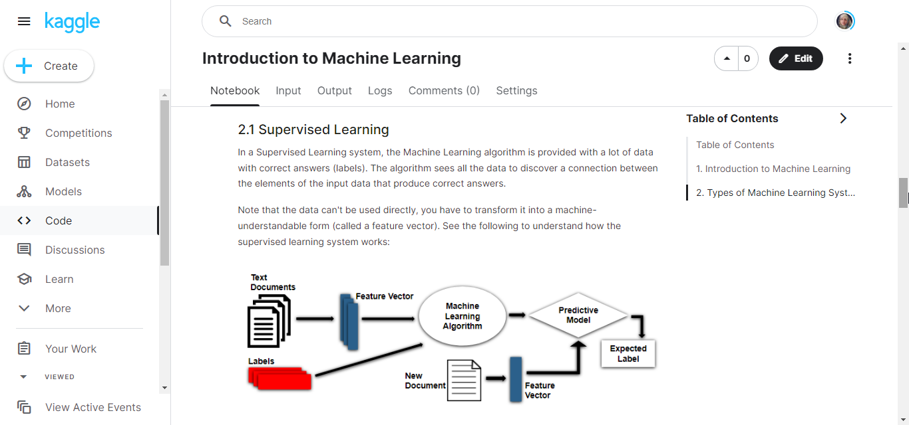

# 1. Introduction to Machine Learning

|  | Wrote an article to educate beginners about Machine Learning. This article included the definition of Machine Learning and types of machine learning systems. All were explained using examples. [Read More](https://medium.com/@gl7526/making-a-folder-of-images-for-your-github-readme-2c6cd42e1439) |
| :---: | :--- |
